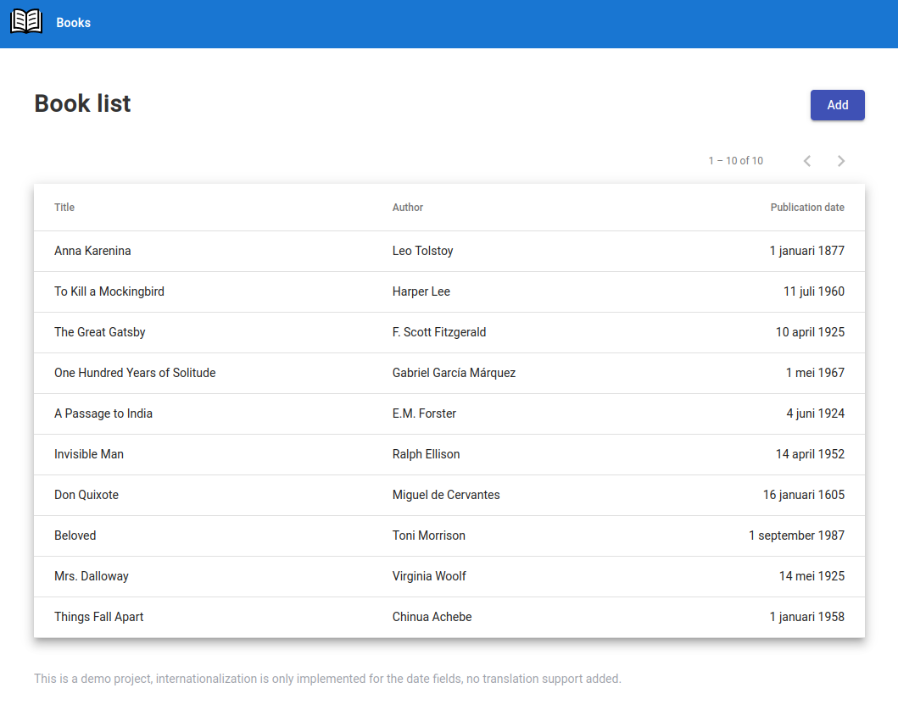
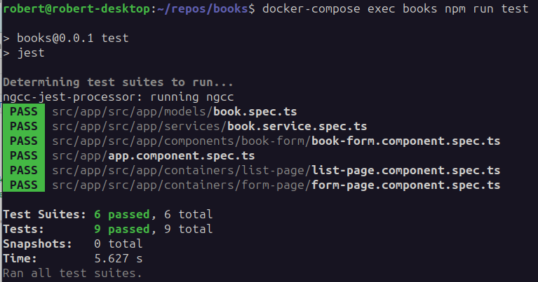
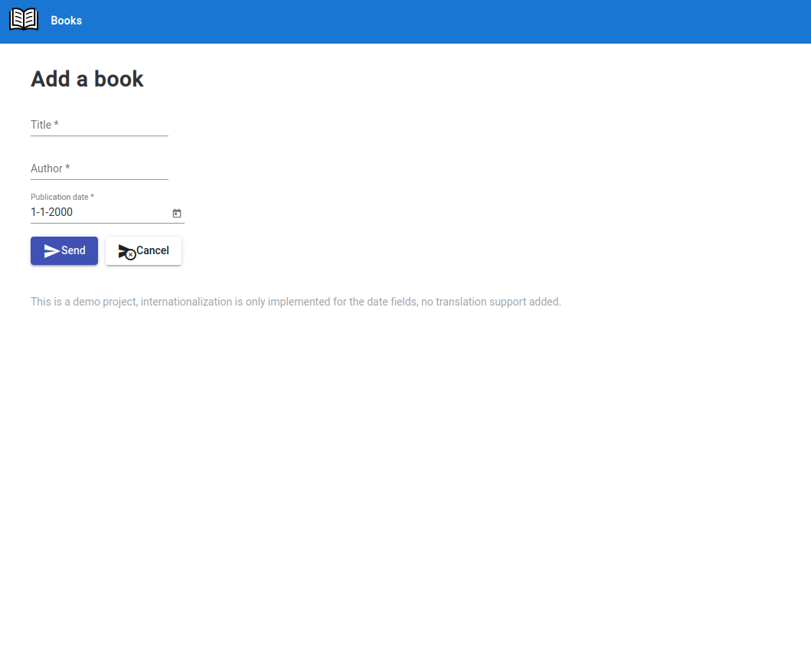

# Books

A demo Angular 14 project with RxJS, NgRx, and Jest.



## Development server

There are two ways to use the repository, both will end up with the site at http://localhost:4200

### Using docker
There is a docker compose setup that starts the server and runs the npm install. 
Het site will be available at http://localhost:4200
```bash
docker-compose up
```

### Running locally
Running local requires a pre-installed nodejs and npm.
```bash
npm install
ng serve
```

## Running unit tests

The unit tests are run with Jest.

```bash
# Using docker
docker-compose exec books npm run test

# Running local
npm run test
```



## EXTRA LIBRARIES

These packages were not required for the demo, but added improvements.

- The Luxon package offers great support in the form of a DateTime object
  - https://moment.github.io/luxon/#/?id=luxon
- Angular Material improves the style and provides some ui components.
  - https://material.angular.io/
- THe UUID library helps create uuids
  - https://www.npmjs.com/package/uuid
- The app logo was downloaded from uxwing.com
  - https://uxwing.com/open-book-icon/
  - https://uxwing.com/license/


